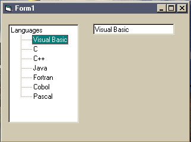



## Treeview MouseMove

### Description

When a user moves the mouse over a node in the treeview, the node is highlighted and the node text value can be passed. In the example, I pass the value to a text box.
 
### More Info
 

             |
---                |---
**Submitted On**   |2002-01-23 13:39:54
**By**             |[Kenneth G\. Young II](https://github.com/Planet-Source-Code/PSCIndex/blob/master/ByAuthor/kenneth-g-young-ii.md)
**Level**          |Intermediate
**User Rating**    |5.0 (10 globes from 2 users)
**Compatibility**  |VB 6\.0
**Category**       |[Miscellaneous](https://github.com/Planet-Source-Code/PSCIndex/blob/master/ByCategory/miscellaneous__1-1.md)
**World**          |[Visual Basic](https://github.com/Planet-Source-Code/PSCIndex/blob/master/ByWorld/visual-basic.md)
**Archive File**   |[Treeview\_M505611232002\.zip](https://github.com/Planet-Source-Code/kenneth-g-young-ii-treeview-mousemove__1-31101/archive/master.zip)

